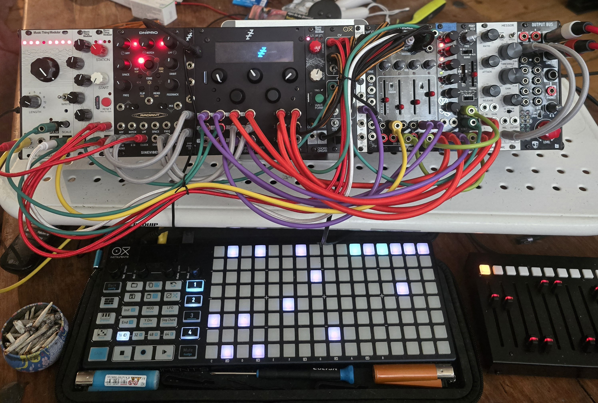
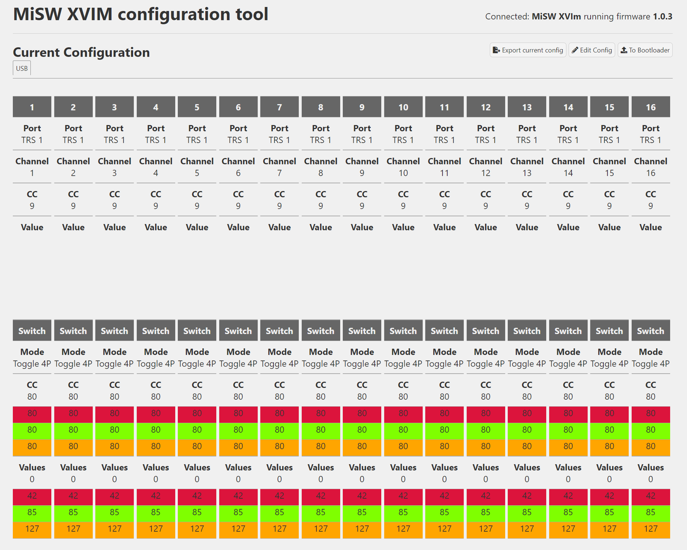
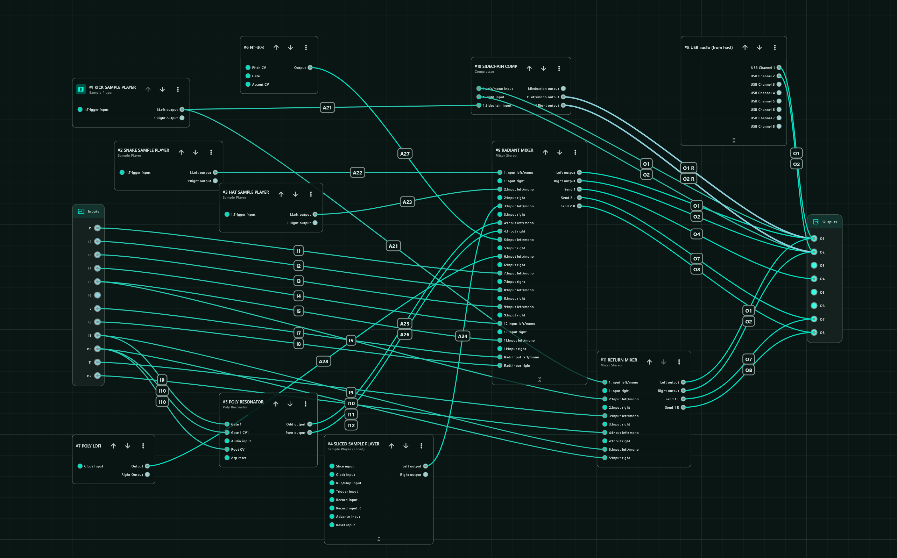

# Witchboard

Witchboard is a routing mixer and serial patchbay plugin for the Expert Sleepers
disting NT. It was built for patches where a source should be playable like a
normal mixer channel, but also be able to jump cleanly through hardware inserts,
external FX, and compressor-bypass paths from a MIDI controller.

It is not a conventional mixer with a bigger channel count. It is the missing
shape between a mixer, a patchbay, and a performance controller.

```text
source
  -> channel gain
  -> Insert 1: Dry / Route A / Route B / Route C
  -> Insert 2: Dry / Route A / Route B / Route C
  -> FX Send 1 dry/wet crossfade
  -> FX Send 2 dry/wet crossfade
  -> Main or Bypass output path
```

One Witchboard instance can provide up to 12 source channels. Each channel has
two independent insert selectors, two FX crossfades, gain, repeat protection, and
a final Main/Bypass output choice.

## Why It Exists

The disting NT already has excellent mixer algorithms, but this patch wanted a
different kind of control:

- one button should choose exactly one insert route from four states
- a second button should choose a second insert after the first
- a fader should control source gain
- another fader should crossfade into a stereo FX processor
- selected channels should bypass the compressor while the rest go through it
- all of this should stay readable on the NT screen and mappable with the native
  MIDI Mapping system

Doing that with stock mixers quickly becomes a mixer stack rather than a patch.
For the supplied four-channel hardware preset, a practical stock version wants
roughly seven separate mixer/router jobs: source/main mixing, compressor bypass,
three hardware insert send/return paths, stereo FX send/return handling, and final
output routing. The harder part is not only the algorithm count; it is the control
surface. Four channels with two 4-state insert buttons already means 32 discrete
route choices before gain, FX, and output routing. At the full 12-channel size,
the insert selectors alone represent 24 four-state controls, or 96 possible route
targets, if patched as ordinary mixer levels or mutes.

In my current patch, doing this as one purpose-built plugin is also dramatically
lighter on the disting NT CPU than building the same routing matrix from stock
mixers. The Witchboard version is roughly an order of magnitude cheaper than the
mixer-stack version it replaces.

Witchboard compresses that into normal NT parameters:

- `Insert 1`
- `Insert 2`
- `Gain`
- `FX Send 1 mix`
- `FX Send 2 mix`
- `Output path`

The result is much closer to playing a hardware performance matrix than managing
a pile of mixer channels.

## 4-State MIDI Buttons

The important trick is that Witchboard exposes each insert selector as a normal
four-state NT enum parameter:

| Parameter value | Meaning |
|---:|---|
| 0 | Dry |
| 1 | Route A |
| 2 | Route B |
| 3 | Route C |

There is no private MIDI parser in the plugin. MIDI is owned by the disting NT's
native MIDI Mapping system, so any parameter can be mapped, remapped, saved, and
edited the normal NT way.

The included hardware preset is set up for 4-state MIDI buttons that send these
values on a single CC:

| Button state | MIDI value | Witchboard state |
|---|---:|---|
| Off | 0 | Dry |
| Red | 42 | Route A |
| Green | 85 | Route B |
| Orange | 127 | Route C |

The preset maps the button CC with `Min = 0` and `Max = 4`. That is intentional.
With controllers that send `0 / 42 / 85 / 127`, this creates four clean buckets
for the NT mapping system, then Witchboard clamps the result to its valid enum
range of `0..3`.

For the supplied preset:

| Button state | Route name |
|---|---|
| Off | Dry |
| Red | Threetom MS22 |
| Green | Pico MMF |
| Orange | Percall 4 |

This makes a 4-state MIDI button behave like a miniature patchbay selector
instead of an on/off switch.

## Signal Flow

Each channel is processed independently:

```text
Input/Left + optional Right Input
  -> Gain
  -> Insert 1 send/return
  -> Insert 2 send/return
  -> FX Send 1 dry/wet crossfade
  -> FX Send 2 dry/wet crossfade
  -> Main or Bypass output pair
```

Insert routes can be mono or stereo. Mono returns are copied to both sides before
the signal continues. FX returns are shared and mixed once, not once per source.

`Repeat protection` prevents a channel from selecting the same route for both
inserts. For example, if Insert 1 is already using Route A, Insert 2 selecting
Route A is treated as Dry.

`Switch fade` smooths gain, insert changes, and FX crossfades to avoid clicks.

## Parameters

Witchboard has one specification:

| Specification | Range | Default |
|---|---:|---:|
| `Channels` | 1-12 | 4 |

Global pages configure:

- three insert routes, each with send bus, return bus, mono/stereo width, and
  output mode
- Main and Bypass stereo output pairs
- two stereo FX sends with returns and return paths
- switch fade time

Each channel provides:

| Parameter | Purpose |
|---|---|
| `Enable` | Turns the channel on or off |
| `Input/Left` | Mono input, or left side of a stereo input |
| `Right Input` | Optional right side of a stereo input |
| `Gain` | Channel level, `-inf` to `0 dB` |
| `Insert 1` | First four-state route selector |
| `Radiant mix` / `FX Send 1 mix` | Dry/wet crossfade into FX Send 1 |
| `Insert 2` | Second four-state route selector |
| `Output path` | Main or Bypass |
| `Repeat protection` | Prevents both inserts choosing the same route |
| `FX Send 2 mix` | Dry/wet crossfade into FX Send 2 |

Route and FX names can be supplied by preset JSON under `witchboardNames`, so a
hardware preset can show names such as `Threetom MS22`, `Pico MMF`, `Percall 4`,
and `Radiant`.

## Included Hardware Preset

`presets/Witchboard Example.json` is a complete four-channel example.
It shows Witchboard being used as a performance router for a small hardware
system built around three mono insert processors, one stereo FX processor, and a
Michigan Synth Works XVI-M MIDI controller.

| Witchboard channel | Source | Input | Output path | MIDI strips |
|---:|---|---|---|---|
| 1 | Radio Station | I1 | Main | 1 + 2 |
| 2 | Chord Organ | I2 | Main | 3 + 4 |
| 3 | Bass | I3 | Main | 5 + 6 |
| 4 | Kick | Aux 21 | Bypass | 7 + 8 |

Hardware in this example:

| Role | Hardware | Witchboard connection |
|---|---|---|
| Source 1 | Radio Station through Percall 1 | I1 |
| Source 2 | Chord Organ through Percall 2 | I2 |
| Source 3 | Bass / Pony VCO voice | I3 |
| Source 4 | Kick Sample Player | Aux 21 |
| Insert A | Threetom MS22 | O3 -> MS22 -> I12 |
| Insert B | Pico MMF | O4 -> Pico MMF -> I11 |
| Insert C | Percall 4 | O5 -> Percall 4 -> I4 |
| Stereo FX | Radiant | O7/O8 -> Radiant -> I7/I8 |
| Final processor | Messor | O1/O2 -> Messor |

Reference images for my example setup:

| Asset | Shows |
|---|---|
| `assets/babyjaws.jpg` | My hardware setup for this preset. |
| `assets/midiController.png` | My known-correct MiSW XVI-M controller configuration for this preset. |
| `assets/current-patch-radiant-mixer-target.png` | My current NT patch context around the mixer/router section Witchboard replaces or simplifies. |

These images are examples of how I use Witchboard. They are not requirements for
the plugin. Witchboard exposes normal NT parameters, so the same plugin can be
mapped to different controllers, routes, inputs, and outputs.







The preset names the routes:

| Route | Hardware |
|---|---|
| Route A | Threetom MS22 |
| Route B | Pico MMF |
| Route C | Percall 4 |
| FX Send 1 | Radiant |
| FX Send 2 | iPad / spare |

The MIDI layout uses two adjacent controller strips per Witchboard channel:

| Strip in pair | Fader | Button |
|---|---|---|
| First strip | `CC9` -> channel Gain | `CC80` -> Insert 1 |
| Second strip | `CC9` -> Radiant mix | `CC80` -> Insert 2 |

The controller I use in this example is a Michigan Synth Works XVI-M:

| XVI-M strips | Port | MIDI channels | Faders | Buttons |
|---:|---|---:|---|---|
| 1-16 | TRS 1 | 1-16 | `CC9` | Toggle 4P, `CC80` |

The `Witchboard Example` preset uses strips 1-8 for my four-channel example.
Strips 9-16 follow the same controller pattern and are ready for manual mapping,
or for expanding Witchboard to more channels.

Each XVI-M button uses the same four transmitted values:

```text
0, 42, 85, 127
```

The preset stores 16 native NT MIDI mappings: four controls for each of four
channels.

## Installation

Build the plugin:

```sh
make
```

By default the Makefile expects the official API at `../distingNT_API`. Override
it with `NT_API_PATH` if needed:

```sh
make NT_API_PATH=/path/to/distingNT_API
```

Copy the compiled object to the disting NT MicroSD card:

```text
plugins/Witchboard.o -> /programs/plug-ins/Witchboard.o
```

Then rescan plugins or restart the module.

The included preset can be copied to your NT preset folder and loaded after the
plugin is installed:

```text
presets/Witchboard Example.json
```

Firmware/API note: this plugin is built against the official disting NT plugin
API v13.

## Repository Layout

```text
Makefile
src/WitchboardClean.cpp
plugins/Witchboard.o
presets/Witchboard Example.json
assets/babyjaws.jpg
assets/midiController.png
assets/current-patch-radiant-mixer-target.png
tests/WitchboardCleanTest.cpp
tests/validate_preset.py
GUIDE.md
WIRING.md
```

`src/WitchboardClean.cpp` is the current source used by the Makefile.

## Validation

The repo includes two focused checks:

```sh
python3 tests/validate_preset.py
```

Validates the supplied preset, including the 4-state MIDI mapping buckets:

```text
0 / 42 / 85 / 127 -> Dry / Route A / Route B / Route C
```

The C++ host test includes the plugin source and verifies that channel parameters
are independent:

```sh
g++ -std=c++11 -I/path/to/distingNT_API/include tests/WitchboardCleanTest.cpp -o /tmp/WitchboardCleanTest
/tmp/WitchboardCleanTest
```

## Design Rules

Witchboard deliberately follows a simple NT-native model:

- all controls are exposed as ordinary NT parameters
- MIDI mapping is handled by the NT host, not by plugin-owned MIDI code
- insert buttons are enum parameters, not raw MIDI values
- route names come from preset serialization, not hardcoded controller logic
- audio routing is explicit and per-channel

That keeps the plugin portable across controllers and editable from the NT's own
mapping UI.

## References

- Project repository: https://github.com/nymphnerds/witchboard
- Expert Sleepers disting NT API: https://github.com/expertsleepersltd/distingNT_API
- Expert Sleepers disting NT resources: https://github.com/expertsleepersltd/distingNT
- Expert Sleepers firmware/manuals: https://www.expert-sleepers.co.uk/distingNTfirmwareupdates.html
- Michigan Synth Works XVI-M: https://michigansynthworks.com/products/xvi-m
