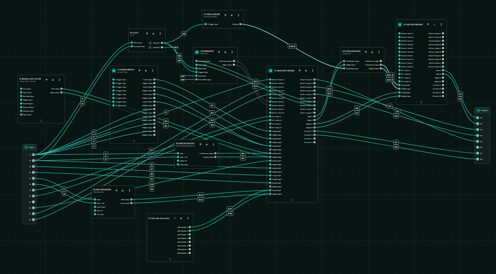
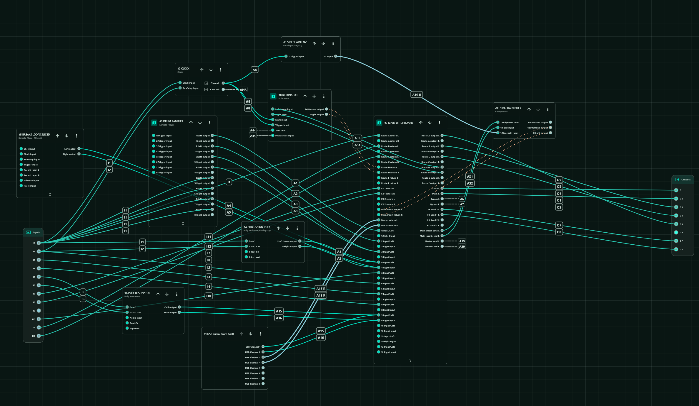

# Witchboard

Witchboard is a routing mixer and serial patchbay plugin for the Expert Sleepers
disting NT. It was built for patches where a source should be playable like a
normal mixer channel, but also be able to jump cleanly through hardware inserts,
external FX, computer or iPad processing, and compressor-bypass paths from a MIDI
controller.

It is not a conventional mixer with a bigger channel count. It is the missing
shape between a mixer, a patchbay, and a performance controller.

## Why This Branch Exists

This branch adds end-of-chain routing to Witchboard.

The goal is simple: one Witchboard instance should be able to act as the main
routing matrix, the compressor-bypass mixer, and the final stereo insert point.
That means a patch can stay readable instead of needing an extra "end
Witchboard" just to join things back together at the end.

In the old patch shape, the main Witchboard sent some channels through a
sidechain compressor and sent other channels around it on a bypass lane. A
second Witchboard instance then had to sit at the end of the patch to sum those
two lanes back to outputs 1/2.

This branch lets the main Witchboard do that final job itself:

- `Main` is the normal mix path.
- `Main insert` is for processing the Main path, for example sidechain ducking.
- `Bypass` skips the Main insert, so kicks or other sounds can avoid the duck.
- `Master output` decides what happens after Main and Bypass meet again.
- `Master output: Insert` sends the whole final stereo mix out and brings it
  back, useful for an iPad, computer, DJ-style processor, or mastering chain.

The intended before/after is:





```text
Before:

Main Witchboard -> sidechain duck -> End Witchboard -> outputs 1/2
       bypass ------------------------^

After:

Main Witchboard -> Main insert -> Master insert -> outputs 1/2
       bypass --------^
```

## Bus Insert Flow

Think of Witchboard as making two buckets:

- `Main`: the normal mix bucket.
- `Bypass`: the bucket that skips Main insert processing.

The full flow is:

```text
Inputs
  |
  v
Channels
  |
  |-- Insert 1: Dry / Slot 1 / Slot 2 / Slot 3
  |
  |-- Insert 2: Dry / Slot 1 / Slot 2 / Slot 3
  |
  |-- FX Send 1 / FX Send 2
  |
  v
Output Path
  |
  +--> Main
  |      |
  |      v
  |   Main insert
  |   Off: Main carries on unchanged
  |   On:  Main -> Main insert send -> processor -> Main insert return
  |
  +--> Bypass
         |
         | skips Main insert
         v

Master output
  |
  |-- Split:
  |     Main goes to Main L/R
  |     Bypass goes to Bypass L/R
  |
  |-- Sum:
  |     Main + Bypass goes to Main L/R
  |
  |-- Insert:
  |     Main + Bypass -> Master send -> processor -> Master return -> Main L/R
  |
  v
Outputs
```

In plain words:

- `Main insert` is for processing only the Main bucket.
- `Bypass` skips the Main insert, then can rejoin later.
- `Master output: Split` keeps Main and Bypass separate, like older patches.
- `Master output: Sum` joins Main and Bypass inside Witchboard.
- `Master output: Insert` joins Main and Bypass, sends the whole mix out, then
  uses the return as the final Main output.

```text
source
  -> channel gain
  -> Insert 1: Dry / Slot 1 / Slot 2 / Slot 3
  -> Insert 2: Dry / Slot 1 / Slot 2 / Slot 3
  -> FX Send 1 overlap dry/wet control
  -> FX Send 2 overlap dry/wet control
  -> Main or Bypass output path
```

One Witchboard instance can provide up to 12 source channels. Each channel has
two independent insert selectors, two FX send controls, gain, repeat protection,
and a final Main/Bypass output choice.

| Plug-in | GUID | Release file |
|---|---|---|
| Witchboard | `WtC1` | `Witchboard.o` |

## Latest Change

The FX send mix curve has been changed from the old normalized cubic crossfade
to an overlap-style dry/wet control. From `0..50%`, dry stays full while wet
fades in. From `50..100%`, wet stays full while dry fades out. This avoids the
centre dip and keeps the source punch intact while adding FX.

## Why It Exists

The disting NT already has excellent mixer algorithms, but this patch wanted a
different kind of control:

- one button should choose exactly one insert slot from four states
- a second button should choose a second insert after the first
- a fader should control source gain
- another fader should blend into a stereo FX processor
- selected channels should bypass the compressor while the rest go through it
- all of this should stay readable on the NT screen and mappable with the native
  MIDI Mapping system

Doing that with stock mixers quickly becomes a mixer stack rather than a patch.
The harder part is not only the algorithm count; it is the control surface. Four
channels with two 4-state insert buttons already means 32 discrete route choices
before gain, FX, and output routing. At the full 12-channel size, the insert
selectors alone represent 24 four-state controls, or 96 possible route targets,
if patched as ordinary mixer levels or mutes.

In the patch Witchboard was built for, doing this as one purpose-built plugin was
also dramatically lighter on the disting NT CPU than building the same routing
matrix from stock mixers. The Witchboard version was roughly an order of
magnitude cheaper than the mixer-stack version it replaced.

Witchboard compresses that into normal NT parameters:

- `Insert 1`
- `Insert 2`
- `Gain`
- `FX Send 1 mix`
- `FX Send 2 mix`
- `Output path`

The result is much closer to playing a hardware performance matrix than managing
a pile of mixer channels.

## What's Changed From v1.0.0

Compared with the old main-branch release, `v1.1.1` expands Witchboard from the
original fixed insert layout into a 12-channel routing matrix with five
assignable insert routes. Each channel now has per-channel Slot 1/2/3 route
assignments for both insert stages, so the same four-state control can mean
different hardware paths on different channels.

The 4-state insert selectors now work cleanly from buttons, faders, knobs, or
CV-mapped controls. Outputs are fixed to Add so the plugin stays within the NT
parameter limit, and the public release now ships as `Witchboard.o` plus
`Witchboard.zip`. `v1.1.1` keeps that behavior and cleans up per-instance page
storage so differently sized Witchboard instances do not share mutable page
layout data.

The next update changes the FX send mix from the old normalized crossfade to an
overlap-style dry/wet control. The dry signal now stays full while wet comes in,
then the wet signal stays full while dry fades out.

## Signal Flow

Each channel runs:

```text
Input/Left + optional Right Input
-> Gain
-> Insert 1
-> Insert 2
-> FX Send 1 overlap dry/wet control
-> FX Send 2 overlap dry/wet control
-> Main or Bypass output path
```

Witchboard supports `1..12` channels. Unused channels can stay disabled or have
`Input/Left` set to `None`.

## Basic Setup

1. Set the `Channels` specification.
2. Set each channel's `Input/Left`.
3. For stereo sources, also set `Right Input`.
4. Set `Main L/R` to the normal destination.
5. Set `Bypass L/R` if some channels should skip a later processor.
6. Configure the insert routes you want to use.
7. Configure FX Send 1/2 only if you need shared send/return FX.

## Generic Example

Say you have four sources and three insert paths:

```text
Channel 1 -> drum voice
Channel 2 -> bass voice
Channel 3 -> chord voice
Channel 4 -> lead voice

Route A -> mono filter
Route B -> iPad or computer send/return
Route C -> stereo distortion
```

Patch each source into a Witchboard channel. Patch each processor or external
device as an insert route with a send output and return input. Then set each
channel's insert slots:

| Channel | Slot 1 | Slot 2 | Slot 3 |
|---:|---|---|---|
| 1 | Route A | Route C | Route B |
| 2 | Route A | Route B | Route C |
| 3 | Route B | Route A | Route C |
| 4 | Route C | Route A | Route B |

Now `Insert 1` and `Insert 2` work like quick selectors. The same button, fader,
or knob can move a channel from Dry to Slot 1, Slot 2, or Slot 3 without changing
patch cables.

## Insert Routes

Witchboard has five generic insert routes:

```text
Route A
Route B
Route C
Route D
Route E
```

Each route has a send output, return input, send width, and return width.

For mono hardware, set send width and return width to `Mono`. For stereo
hardware, set both widths to `Stereo` and set both L/R buses.

All Witchboard outputs are fixed to Add. There are no Add/Replace output-mode
parameters in the current layout.

## Insert Slots

Each channel has two live insert selectors:

```text
Insert 1
Insert 2
```

Each selector chooses:

| Value | State |
|---:|---|
| 0 | Dry |
| 1 | Slot 1 |
| 2 | Slot 2 |
| 3 | Slot 3 |
| 4 | Slot 3 |

The slots are per channel and per insert. A slot is not hardwired to one route;
the slot assignment parameters decide what route each slot uses:

```text
Insert 1 slot 1..3 -> Route A..E
Insert 2 slot 1..3 -> Route A..E
```

Default slot assignments are Slot 1 = Route A, Slot 2 = Route B, and Slot 3 =
Route C.

`Repeat protection` stops one channel from using the same route twice in series.
When it is On, a duplicate route choice in Insert 2 behaves as Dry. When it is
Off, both insert stages may use the same assigned route.

## Four-State Control

The insert selectors are normal NT parameters, so they can be mapped to a
4-state button, fader, knob, CV-mapped control, or any other NT-mappable source.

A common 4-state controller sends:

```text
0, 42, 85, 127
```

Map that controller to `Insert 1` or `Insert 2` with:

```text
Min = 0
Max = 4
```

That creates four useful zones:

| Incoming value | Result |
|---:|---|
| 0 | Dry |
| 42 | Slot 1 |
| 85 | Slot 2 |
| 127 | Slot 3 |

The extra top value, `4`, is handled as Slot 3. This keeps `0 / 42 / 85 / 127`
controllers landing on the intended four states.

For a fader or knob, think of the same control as four zones:

```text
low      -> Dry
low-mid  -> Slot 1
high-mid -> Slot 2
high     -> Slot 3
```

## FX Sends

Each channel has:

```text
FX Send 1 mix
FX Send 2 mix
```

Each mix is an overlap-style dry/wet control from the channel path into the
shared FX send, smoothed by `Switch fade`.

From `0..50%`, the dry path stays fully on while the wet send fades in. At
`50%`, dry and wet are both fully on. From `50..100%`, the wet send stays fully
on while the dry path fades out. This avoids the centre dip of an equal-power
crossfade and works well for performance-style send moves.

At `0%`, the channel stays dry and sends nothing to that FX output. At `100%`,
the channel is fully sent to that FX output and removed from the dry Main/Bypass
path for that send stage.

Each FX return can be routed to Main or Bypass with `FX 1 return path` and
`FX 2 return path`. FX returns are shared and mixed once, not once per source
channel.

## Output Paths

Each channel can route to:

| Output path | Destination |
|---|---|
| Main | `Main L/R` |
| Bypass | `Bypass L/R` |

Use Bypass when a channel should skip a later processor.

## Naming

Witchboard can show preset-specific names for routes, FX sends, and insert slot
states. Names are preset data, not hardcoded plugin logic.

Preset serialization supports:

```text
witchboardNames.routes
witchboardNames.fx
witchboardNames.slots
```

## Parameter Count

Witchboard uses `49` global parameters and `16` parameters per channel.

| Channels | Plugin parameters |
|---:|---:|
| 1 | 65 |
| 4 | 113 |
| 8 | 177 |
| 12 | 241 |

The current layout is designed so a 12-channel instance fits under the NT
parameter limit.

## Installation

Copy the object to the disting NT MicroSD card:

```text
Witchboard.o -> /programs/plug-ins/Witchboard.o
```

Then rescan plugins or restart the module.

This plugin is built against the official disting NT plugin API v13.

## Building

```sh
make
```

By default the Makefile expects the official API at `../distingNT_API`. Override
it with `NT_API_PATH` if needed:

```sh
make NT_API_PATH=/path/to/distingNT_API
```

For a release-ready local check:

```sh
make package NT_API_PATH=/path/to/distingNT_API
```

That runs validation, the focused C++ host test, ARM build, object inspection,
and creates release artifacts.

## Quick Check

After installing a new object:

1. Add or load Witchboard.
2. Confirm `Channels` can be set to the count you need.
3. Set one channel input and leave both inserts Dry.
4. Confirm dry audio reaches Main or Bypass.
5. Configure one route send/return.
6. Assign that route to `Insert 1 slot 1`.
7. Change `Insert 1` from Dry to Slot 1.
8. Confirm audio switches route immediately.
9. Map a controller to `Insert 1` with `Min = 0`, `Max = 4`.
10. Confirm the control selects Dry / Slot 1 / Slot 2 / Slot 3.

## Repository Layout

```text
Makefile
plugins/Witchboard/Witchboard.cpp
scripts/
tests/
```

`plugins/Witchboard/Witchboard.cpp` is the current source used by the Makefile.
